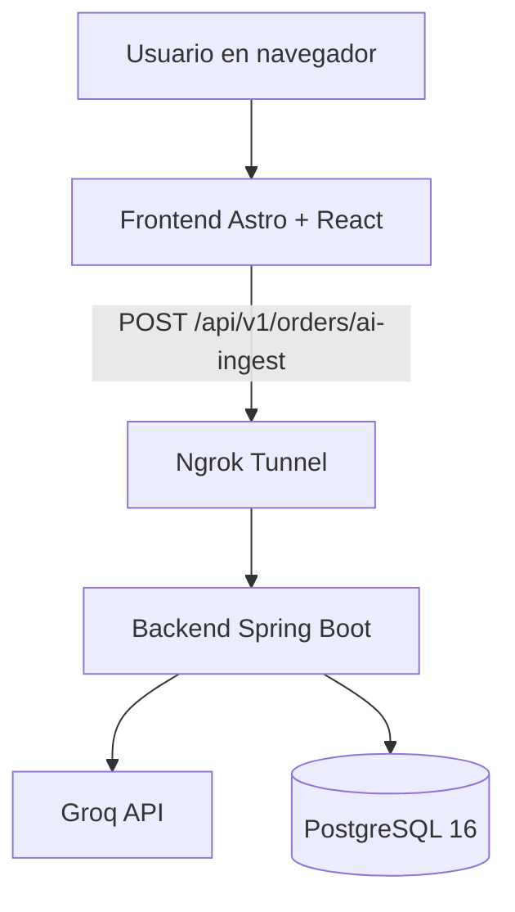
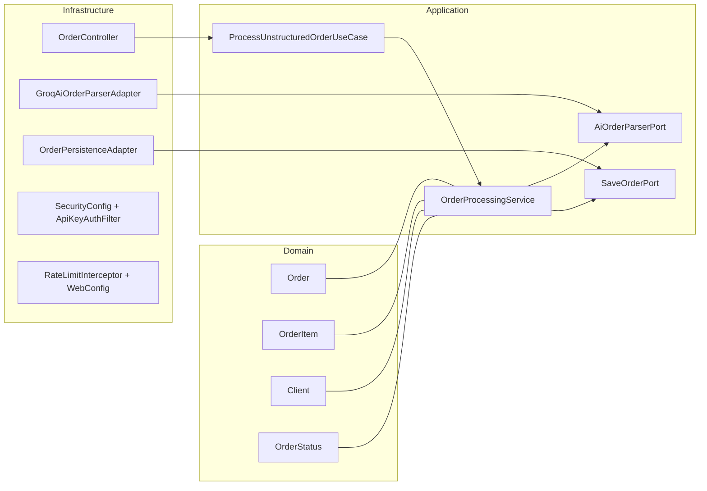
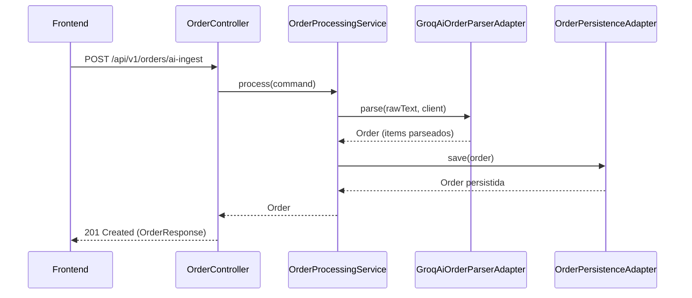
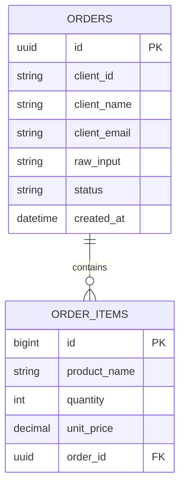

# Smart Order AI MVP

MVP B2B para convertir pedidos no estructurados (correo, WhatsApp, texto libre) en una orden estructurada con items, importes y estado, usando IA (Groq) + arquitectura hexagonal en backend + frontend estático en Astro/React.

## 1) Objetivo del proyecto

Este proyecto resuelve el problema de recibir pedidos en lenguaje natural y transformarlos en una estructura consistente para sistemas internos.

Capacidades actuales:
- Ingesta de texto libre desde frontend web.
- Parseo con IA hacia JSON estricto.
- Persistencia en PostgreSQL.
- API REST versionada.
- Seguridad base para MVP: API key, rate limiting, validación de entrada y headers de seguridad.
- Deploy híbrido: frontend estático (Hostinger) + backend local expuesto por ngrok.

---

## 2) Arquitectura general



### Arquitectura interna del backend (Hexagonal)



### Flujo principal de procesamiento



---

## 3) Stack tecnológico y versiones

### Backend
- Java 21
- Spring Boot 4.0.3
- Spring Web MVC
- Spring Data JPA
- Spring Security
- Spring Validation
- Bucket4j 7.6.0
- PostgreSQL Driver
- Lombok

### Frontend
- Astro 5.x (output static)
- React 19
- TypeScript 5.7
- Tailwind CSS 4.2
- react-syntax-highlighter 16.1

### Infra y tooling
- Docker + Docker Compose
- PostgreSQL 16 (imagen postgres:16-alpine)
- Ngrok (túnel público)
- Maven Wrapper (backend/mvnw)
- npm (frontend)

---

## 4) Base de datos

Motor actual:
- PostgreSQL 16
- Esquema generado por JPA (hibernate ddl-auto=update)

Modelo principal:



Notas:
- Client está denormalizado en la tabla ORDERS para simplificar el MVP.
- La relación Order -> Items es 1:N.
- En producción se puede separar Client a tabla propia si el dominio lo requiere.

---

## 5) Seguridad implementada (MVP)

- Autenticación por API key en header X-API-Key para /api/**.
- Comparación de API key en tiempo constante (mitigación básica de timing attack).
- Rate limit por IP: 20 requests/min en /api/**.
- Validación de payload con Jakarta Validation en el DTO de entrada.
- Headers de seguridad en Spring Security:
  - X-Frame-Options: DENY
  - X-Content-Type-Options: nosniff
  - HSTS habilitado
- CORS configurable por variable de entorno.
- Puerto de PostgreSQL no expuesto hacia fuera del compose.

Importante:
- Este nivel es razonable para un MVP.
- Si quieres endurecer producción real: auth robusta (JWT/OAuth2), gestión central de secretos, WAF/reverse proxy, TLS extremo a extremo, observabilidad y límites distribuidos (Redis).

---

## 6) Estructura de carpetas

```text
smart-order-mvp/
├─ backend/
│  ├─ Dockerfile
│  ├─ pom.xml
│  ├─ mvnw
│  └─ src/
│     ├─ main/
│     │  ├─ java/tech/fearg/smartorder/
│     │  │  ├─ Application.java
│     │  │  ├─ domain/
│     │  │  ├─ application/
│     │  │  └─ infrastructure/
│     │  │     ├─ adapter/in/web/
│     │  │     ├─ adapter/out/ai/
│     │  │     ├─ adapter/out/persistence/
│     │  │     └─ config/
│     │  └─ resources/
│     │     └─ application.properties
│     └─ test/
├─ frontend/
│  ├─ package.json
│  ├─ astro.config.mjs
│  └─ src/
│     ├─ components/SmartOrder.tsx
│     ├─ hooks/useOrderProcessor.ts
│     ├─ pages/index.astro
│     ├─ styles/global.css
│     └─ types/order.ts
├─ docker-compose.yml
├─ .env.example
├─ frontend/.env.example
├─ DEPLOY.md
└─ redeploy.sh
```

---

## 7) Deploy local

### Prerrequisitos

- Docker Desktop activo.
- Node.js 20+ y npm.
- Java 21 (solo si quieres correr backend sin Docker).
- Ngrok instalado y autenticado (solo si necesitas exponer backend al exterior).

### Paso A: configurar entornos

1. Copiar ejemplos y completar valores:

```bash
cp .env.example .env
cp frontend/.env.example frontend/.env
```

2. Editar:
- .env con claves reales de backend.
- frontend/.env con URL de API y API key de frontend.

### Paso B: levantar backend + PostgreSQL

```bash
docker compose up -d --build
```

Verificar contenedores:

```bash
docker compose ps
```

### Paso C: levantar frontend en modo desarrollo

```bash
cd frontend
npm install
npm run dev
```

Abrir en navegador:
- http://localhost:4321

### Paso D: probar endpoint directamente

```bash
curl -X POST http://localhost:8080/api/v1/orders/ai-ingest \
  -H "Content-Type: application/json" \
  -H "X-API-Key: TU_API_KEY" \
  -d '{
    "rawText":"12 cajas de papel A4 a 14.5 y 3 engrapadoras a 9.9",
    "clientId":"client-001",
    "clientName":"Acme Corp",
    "clientEmail":"orders@acme.com"
  }'
```

---

## 8) API principal

Endpoint:
- POST /api/v1/orders/ai-ingest

Headers:
- Content-Type: application/json
- X-API-Key: valor configurado en backend

Respuesta típica:
- 201 Created con OrderResponse

Errores comunes:
- 400 validación de payload
- 401 API key faltante/incorrecta
- 422 parseo IA sin items válidos
- 429 rate limit superado

---

## 9) Comandos útiles

### Backend

```bash
cd backend
./mvnw compile
./mvnw test
```

### Frontend

```bash
cd frontend
npm install
npm run dev
npm run build
npm run preview
```

### Docker

```bash
docker compose up -d --build
docker compose logs -f backend
docker compose down
```

---

## 10) Estado del MVP

Cobertura funcional actual:
- Ingesta y parseo IA funcionando.
- Persistencia PostgreSQL funcionando.
- Frontend responsive funcional con modo offline de demo.
- Seguridad base para MVP aplicada.
- Deploy híbrido documentado y operativo.

Próximos pasos recomendados:
- CI/CD (build, test, scan de secretos).
- Observabilidad (logs estructurados, métricas, tracing).
- Gestión de secretos con vault.
- Estrategia de auth más robusta para producción formal.
